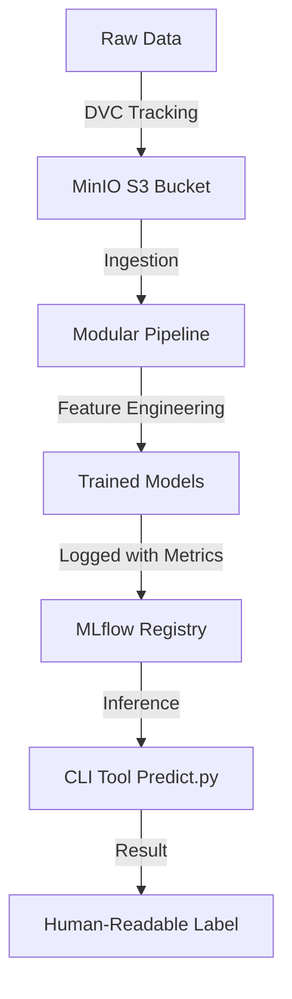

# 🛡️ SecureSurf: Malicious URL Detection Pipeline

SecureSurf is a production-grade MLOps pipeline designed to detect malicious URLs (Phishing, Malware, Defacement, Benign) with high accuracy and full reproducibility. This project transitions from a research notebook to a robust, containerized infrastructure.

---

## 🏗️ MLOps Architecture



### Key Components:
- **Data Versioning (DVC)**: Tracks the `malicious_phish.csv` dataset, storing artifacts in MinIO to ensure your data stays private and versioned.
- **Experiment Tracking (MLflow)**: Automatically logs hyperparameters, accuracy metrics, feature importance, and model files for every training run.
- **Infrastructure (Docker)**: A full stack including MLflow, MinIO, and PostgreSQL, all orchestrated with Docker Compose.
- **CI/CD (GitHub Actions)**: Automated linting and unit testing to maintain code quality.

---

## 🚀 Quick Start (on a new machine)

### 1. Requirements
Ensure you have **Python 3.10+** and **Docker Desktop** installed.

### 2. Infrastructure Setup
Spin up the local MLOps stack (MLflow, MinIO, Postgres):
```powershell
docker-compose up -d
```

### 3. Initialize Virtual Environment
```powershell
python -m venv venv
venv\Scripts\activate
pip install -r requirements.txt
```

### 4. Setup Storage Buckets
Ensure the necessary S3 buckets exist in MinIO:
```powershell
python scripts/create_bucket.py
```

### 5. Pull the Data
Download the dataset tracked by DVC (from the remote artifact store):
```powershell
dvc pull
```

---

## 🧪 Training & Inference

### Run the Pipeline
Train all 6 pre-configured models (Random Forest, AdaBoost, etc.) and log them to MLflow:
```powershell
python main.py
```

### Test a URL (Inference)
Use the `predict.py` CLI tool with a `run_id` from your MLflow dashboard (`http://localhost:5000`):
```powershell
python -m src.predict --url "google.com" --run_id "YOUR_RUN_ID"
```

---

## 📁 Project Structure

```bash
├── .github/workflows/   # CI/CD Pipeline
├── scripts/             # Utility scripts (bucket creation, etc.)
├── src/                 # Modular package
│   ├── config.py        # Central configuration & label maps
│   ├── feature_eng.py   # URL feature extraction logic
│   ├── model_trainer.py # MLflow training & logging engine
│   └── predict.py       # Robust CLI inference tool
├── main.py              # Main pipeline orchestrator
├── docker-compose.yml   # Infrastructure Definition
└── requirements.txt     # Project dependencies
```

---

## ⚖️ License
Distributed under the MIT License. See `LICENSE` for more information.
